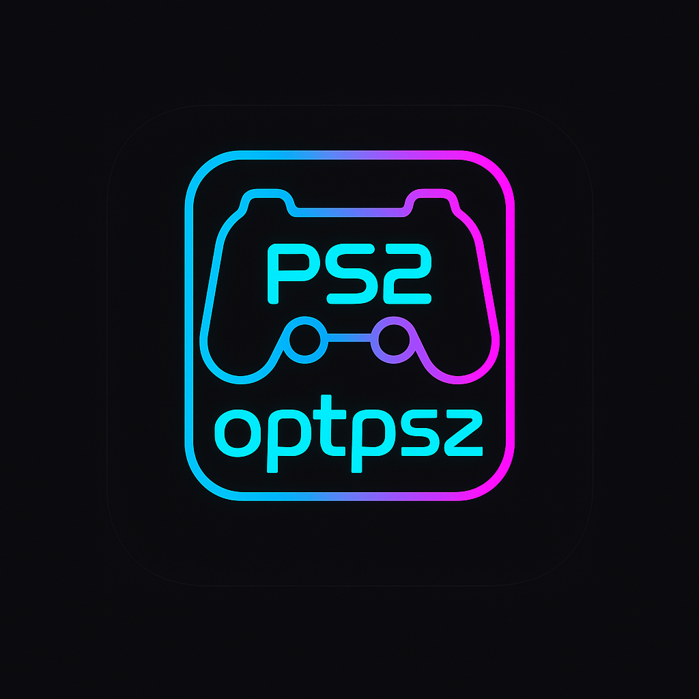

<!-- README inicial para o projeto OptmizeSX2 -->
<p align="center">
  
</p>

# OptmizeSX2

**OptmizeSX2** é um emulador de PlayStation 2 que estou desenvolvendo para Android com foco em desempenho máximo em dispositivos com chips Snapdragon (linha Gen 7 e Gen 8).

## 💡 Visão Geral
- Emulação de alto desempenho com suporte JIT otimizado para ARM64/NEON
- Renderização Vulkan e OpenGL ES
- Sistema modular (CPU, VUs, SPU2, GS, PAD)
- Interface moderna inspirada em AetherSX2/NetherSX2
- Configurações salvas por jogo, save states, suporte a pacotes de texturas e capas

## 📝 Estrutura do Projeto
```
OptmizeSX2/
├── core/                  # Emotion Engine, VUs, Instruções MIPS
├── gpu/                   # Renderizador Vulkan/OpenGL ES
├── spu2/                  # Emulação de áudio
├── ui/                    # Interface Android
├── platform/android/      # Integração com o sistema Android (JNI)
├── assets/                # BIOS, configurações, texturas
├── build.gradle           # Build script
├── CMakeLists.txt         # Configuração de build C++ + NDK
├── .gitignore             # Arquivos ignorados pelo Git
└── README.md
```

## 🚀 Como Compilar
```bash
# Clone o repositório
$ git clone https://github.com/AllamCruz/OptmizeSX2.git
$ cd OptmizeSX2

# Abra no Android Studio e importe como projeto NDK/CMake
# Ou use cmake + ninja para builds manuais
```

## 😎 Licença
Este projeto é um fork/reimaginação baseado em códigos legados e referências do PCSX2 (GPLv2).
Todos os créditos originais são mantidos aos respectivos autores.

---
Desenvolvido com ❤️ por apaixonados por emulação.

> "Emular é preservar a história dos jogos."
